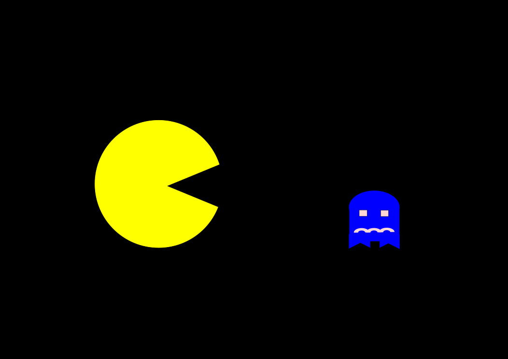

 

  

# pacman

Set of different AI algorithms to play pacman. Will continue to add different approaches to playing the game. 

* A* search
* Markov Decision Process
* Classifiers
* Q-learning

### Running

Each approach has a slightly different API - below is set of commands to run each one

* python pacman.py -n 5 -p PartialAgent -l mediumClassic
* python pacman.py -q -n 10 -p MDPAgent -l mediumClassic

### Todo

* Different search algorithms
* Different classifiers (RF,SVM, gradient boost etc)
* Model and model free reinforcement learning
* Deep reinforcement learning

### License

Distributed under the MIT License

### Contact

gregory.verghese@gmail.com
